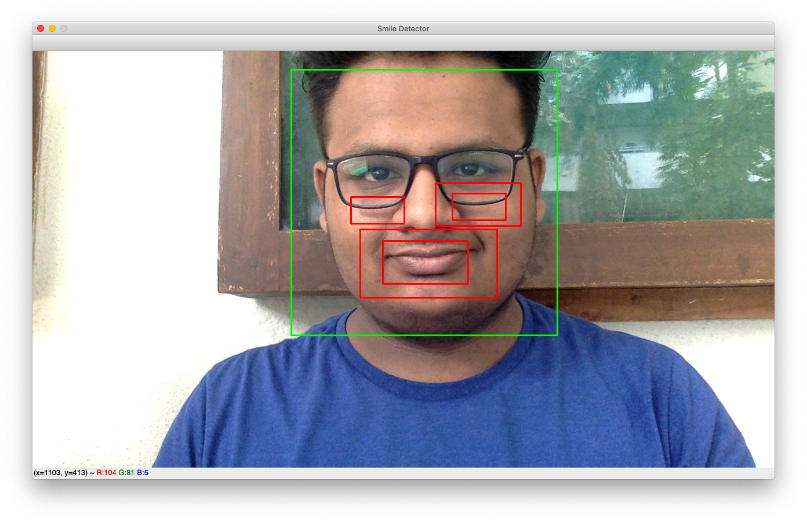

# Smile Detector
#### Detecting smile on a face using pre-defined Harcascade files, provided by OpenCV

This is Smile Detector. It uses Harcascade files for face detection and smile detection which are
provided by OpenCV on their github repository.

##### To Run:-

1. Clone Repository
```
git clone https://github.com/amandesai01/smiledetector.git
```

2. Install requirements:
```
cd smiledetector
pip install opencv
```

3. Run Project:
```
python smile_detector.py
```

##### Screen Shot -

[]
